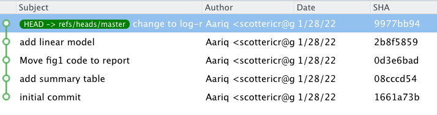

```{r setup, include=FALSE}
options(htmltools.dir.version = FALSE)
knitr::opts_chunk$set(
  fig.width=9, fig.height=3.5, fig.retina=3,
  out.width = "100%",
  cache = FALSE,
  echo = TRUE,
  message = FALSE, 
  warning = FALSE,
  hiline = TRUE
)
```
```{r xaringan-themer, include=FALSE, warning=FALSE}
library(xaringanthemer)
style_mono_accent(base_color = "#23395b")
```

## Outline 

### 1. What is git / GitHub?

--

### 2. Some context for this talk

--

### 3. Benefits of using git / GitHub in ecology

--
.center[
##If you're a non-coder or a coder who has no bandwidth to learn new software, this talk is *still for you*!
]


---

.pull-left[
- **Version control** software

- Tracks *changes* to files, who made those changes, and *why*

- Enables sane management of complicated, evolving projects


  .center[
  #### Example **Repository**:
  
  
  ]
]
.pull-right[

#### Example Git Workflow:

1. You move code for figure from `analysis.R` to `report.Rmd` and delete `fig1.png`  

2. Save changes

3. Take a snapshot with a **commit**.  Must include message explaining changes!

  .center[
  
  ]
]

---


So instead of this:
.pull-left[

]
.pull-right[

]

--

You have this:

.center[

]

---


.pull-left[
- Website for hosting version controlled code and interfacing with git
- Supports sharing and collaborating on code (and other text)
- Repositories can be public or private

#### Typical GitHub workflow:

1. Make **commits**
2. **Push** a series of **commits** to remote repository hosted on GitHub
5. Collaborators (or you on a different computer) can **pull** changes to get most up-to-date version of project

]

.pull-right[

]


---
## Collaborating with GitHub

GitHub also has features that help manage multiple people editing files.

- **Branches** can be used to independently make changes, like each co-author editing their own copy of a manuscript

- **Pull Requests** are a *request* that changes made in a branch are *pulled* into the main branch

- When pull requests are made, there are opportunities to view and review the changes, request further edits, and to deal with conflicts (e.g. someone already edited a line in a different way)


---
class: inverse center middle
# Context: why am I giving this talk?

---
### My git / GitHub journey

2017 — First ever commit.  Added function to query chemical IDs for flavors and aromas to the [`webchem` package](https://github.com/ropensci/webchem).   

--

2018 — Started using GitHub as a way to backup all my analyses

--

2019 — First time really using GitHub collaboratively. `webchem` maintainers invited me to apply for [R Consortium grant](https://www.r-consortium.org/projects/awarded-projects/2019-group-2#webchem:+accessing+chemical+information+from+the+web) with them.

--

2020 — Started collaboration on manuscripts via GitHub: [`webchem` manuscript](https://github.com/EDiLD/webchem_paper) and [first postdoc paper](https://github.com/BrunaLab/HeliconiaDemography) written in R Markdown collaboratively via GitHub

--

2021 — Mentored [REU students](https://github.com/BrunaLab/REU-resources) remotely using GitHub to share and review code and data

--

2021 — [SORTEE conference](https://www.sortee.org/past/).  Started work on [collaborative manuscript]() with working title:
"Not just for programmers: A friendly guide on the versatility/benefits of GitHub for accelerating collaborative research in Ecology and Evolution"

.center[
My inspiration:
**"GitHub is great, but it could be even better with more buy-in from collaborators.  How can I lower barriers?"**
]

---
class: inverse center middle
# Uses and Benefits of GitHub in Ecology


---
## Collaborative Data Analysis

Multiple people can be given permission to work on a single GitHub repository

**A possible workflow for getting feedback on R code:**

- I **push** R code to GitHub and ask Elizabeth to review it

- Elizabeth **clones** repository to her computer and runs the code

- Elizabeth adds some comments, fixes some mistakes, makes commits, **pushes** changes

- I then **pull** her changes and run updated code on my computer

--

More [complicated workflows](https://docs.github.com/en/get-started/quickstart/github-flow) that better manage conflicts exist, but are not strictly necessary

--

### This could be really useful for *remote* and *bi-coastal* labs doing a lot of modeling and data analysis!

---
## Interacting with Published R Code

- Many R packages are developed collaboratively on GitHub

- Some manuscripts share code on GitHub

- Report bugs with **Issues**

- Ask for help in **Discussions**

- Copy and edit code by **forking** repository

- Make contributions with **pull requests**

###Demo:

- Example R Package: https://github.com/lme4/lme4
- Example Discussions: https://github.com/easystats/performance/discussions
- Example manuscript code: https://github.com/weecology/white-etal-2012-ecology
- Example PR: https://github.com/bbolker/bbmle/pull/21


---
## Archiving Data and Code

- Journals increasingly requiring data (and code) to be archived

- GitHub alone not suitable for long-term archiving, but GitHub + Zotero is recommended ([Mislan et al. 2016](https://doi.org/10.1016/j.tree.2015.11.006))

- Archived code is more reliable and often easier to use than journal supplements

- Literally just flip a switch on Zenodo, then create a **release** on GitHub and the whole repository is archived and given a DOI.

.center[
  [](https://github.com/Aariq/PCA-vs-PLS)
]

---
## Websites

GitHub pages is a feature that will turn any .md or .html file on GitHub into a website with a URL

#### Uses from simple to complex:

- Single R Markdown report to send to advisor or collaborators (e.g. https://brunalab.github.io/heliconia-cmip/)

- Host an HTML-based presentation (like this one! https://aariq.github.io/github-for-ecologists/slides/slides.html)

- Summary of a project or manuscript (e.g. https://lter.github.io/lterdatasampler/)

- Website for a course (e.g. https://github.com/weecology/forecasting-course)

- Personal website (e.g. https://masonfidino.com/)

- Lab website (e.g. https://github.com/weecology/website)

---
## Manuscripts
.pull-left[
Although it's not really it's *intended* use, GitHub can be used effectively for collaborative writing.

Some caveats:

- git only tracks differences in *plain text*, so .docx files won't work well (markdown is an alternative)
- Not synchronous like Google Docs
- not as easy to add comments like in Word

Some benefits:
- sane management of conflicts
- centralized discussion and versioning
- everyone has access to most up-to-date version
]

--

.pull-right[
#### Markdown Example:

```
# Heading
## Subheading
```
#### Heading
##### Subheading

```
**bold**, *italics*
```

**bold**, *italics*

```
$y = \alpha_0 + \beta_1 x_1$
```

$y = \alpha_0 + \beta_1 x_1$

]


---
## Where Do I Learn More?

**For more in-depth overview:**

Bryan, Jennifer (2018) “Excuse Me, Do You Have a Moment to Talk about Version Control?” The American Statistician 72(1):20–27. https://doi.org/10.1080/00031305.2017.1399928.

**Step-by-step instructions for R Users:**

www.happygitwithr.com

**GitHub's startup guide:**

https://docs.github.com/en/get-started

**Guide to making a pull-request from RStudio:**

https://usethis.r-lib.org/articles/pr-functions.html

**Making a website**

https://docs.github.com/en/pages/setting-up-a-github-pages-site-with-jekyll

https://rstudio.github.io/distill/website.html

---
class: center, middle

# Thanks!
# Questions?

Slides created via the R packages:

[**xaringan**](https://github.com/yihui/xaringan)<br>
[gadenbuie/xaringanthemer](https://github.com/gadenbuie/xaringanthemer)
